# Rapport de Projet Big Data – Architecture Business Intelligence

**DC Paris – Nicolas LE BOZEC & Alan Garnier**

---

## 1. Contexte et objectifs

Le projet visait à déployer une chaîne Big Data complète, de la collecte à la visualisation, inspirée d'une architecture « CAC40-like » et implémentée principalement en Scala/Spark pour le traitement, ainsi qu'en Rust pour l'accès aux données et la publication via une API REST. Les objectifs étaient :

1. Collecte et ingestion des données taxi jaunes de New York.
2. Stockage dans un Data Lake (Minio).
3. Chargement dans un Data Warehouse (PostgreSQL).
4. Modélisation en Data Mart (schéma en flocon).
5. Exposition et consommation des données via une API Rust.
6. Front-End léger en HTML/CSS/JS pour la consultation des données.
7. Orchestration du pipeline avec Airflow.

---

## 2. Environnement technique

- **Conteneurisation** : Docker Compose orchestre Spark (master + workers), Minio, PostgreSQL (DW et DM), Airflow (webserver, scheduler, worker).
- **Traitement Big Data** : Scala 2.13 + Spark 3.5.5 + Hadoop AWS.
- **Base de données** : PostgreSQL 15.
- **API & Back-End** : Rust (actix-web ou Rocket) pour l'accès aux données du Data Mart.
- **Front-End** : HTML5, CSS3, JavaScript (vanilla).
- **Orchestration** : Airflow (DAG mensuel de bout en bout).

---

## 3. Collecte & Datalake (TP1)

Cette première étape du pipeline de données se concentre sur la collecte de fichiers de données brutes (au format Parquet) à partir d'un système de fichiers local et leur téléversement vers un Data Lake sur S3 (Minio). Le script Scala `spark_data_integration/src/main/scala/dc/paris/integration/Main.scala` orchestre ce processus à l'aide d'Apache Spark.

**Processus détaillé :**

1. **Initialisation de SparkSession** : Une session Spark est créée et configurée avec les paramètres nécessaires pour interagir avec le service S3, incluant les identifiants d'accès (`fs.s3a.access.key`, `fs.s3a.secret.key`), l'URL de l'endpoint S3 (`fs.s3a.endpoint`), et d'autres configurations relatives à la connexion S3 (désactivation SSL, style d'accès au chemin, timeouts, etc.).
2. **Définition des chemins** :
   * `localRawDataPath`: Chemin vers le répertoire local contenant les fichiers Parquet sources (ex: `../data/raw/`).
   * `parquetDirectoryPath`: Chemin de base sur S3 où les fichiers seront téléversés (ex: `s3a://spark/`).
3. **Vérification du répertoire source** : Le script vérifie l'existence et la nature (doit être un répertoire) du `localRawDataPath`.
4. **Listage et filtrage des fichiers locaux** : Si le répertoire source est valide, le script liste tous les fichiers qu'il contient et filtre ceux qui se terminent par l'extension `.parquet`.
5. **Téléversement des fichiers Parquet vers S3** :
   * Si des fichiers Parquet sont trouvés localement, chacun est traité individuellement.
   * Pour chaque fichier, Spark lit le fichier Parquet local dans un DataFrame.
   * Ce DataFrame est ensuite écrit sur S3 dans le `parquetDirectoryPath`, en conservant le nom original du fichier. Le mode d'écriture `overwrite` est utilisé, ce qui signifie que si un fichier du même nom existe déjà à la destination S3, il sera remplacé.
   * Des messages informatifs sont affichés pour suivre la progression et gérer les erreurs potentielles durant le téléversement de chaque fichier.
6. **Vérification post-téléversement (optionnelle)** : Après la tentative de téléversement de tous les fichiers, le script tente de lire les données depuis le `parquetDirectoryPath` sur S3 pour vérifier l'opération. Il affiche le nombre de lignes et un échantillon des données. Il crée également une vue temporaire Spark SQL (`s3_data_view`) pour des requêtes ad-hoc.
   * *Note : Pour une meilleure robustesse lors de cette lecture de vérification depuis S3, surtout si plusieurs fichiers ont été téléversés, il est recommandé d'utiliser `spark.read.option("mergeSchema", "true").parquet(s"$parquetDirectoryPath*.parquet")` pour gérer les schémas potentiellement divergents et s'assurer que seuls les fichiers `.parquet` sont lus.*
7. **Arrêt de la session Spark** : La session Spark est proprement arrêtée à la fin du processus.

Cette étape assure que les données brutes sont disponibles dans le Data Lake pour les traitements ultérieurs.

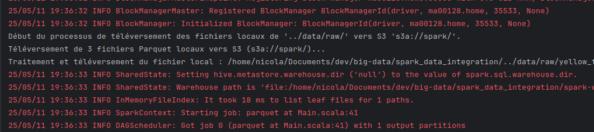
*Fig. 1: Contenu du bucket MinIO (S3) après le téléversement des fichiers Parquet.*
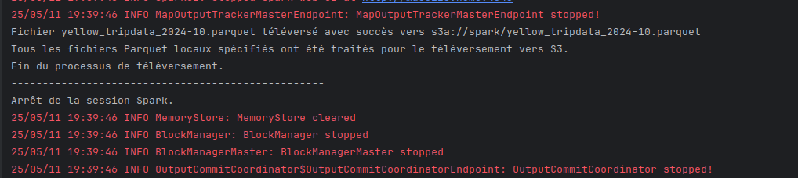
*Fig. 2: Logs Spark montrant le processus de téléversement des fichiers Parquet vers MinIO.*

---

## 4. Datalake → Data Warehouse (TP2)

Cette étape concerne le transfert des données depuis le Data Lake (Minio S3) vers le Data Warehouse (PostgreSQL). Le script principal `spark_data_integration_tp2/src/main/scala/dc/paris/integration/Main.scala` utilise Apache Spark pour cette tâche.

**Processus :**

1. **Configuration Spark Session** : Une session Spark est initialisée avec la configuration nécessaire pour se connecter à un bucket S3 (Minio), incluant les clés d'accès, l'endpoint, et la désactivation SSL pour un environnement de développement local.
2. **Lecture des données Parquet depuis S3** :
   * Les données (par exemple, les données des taxis jaunes de New York) sont stockées au format Parquet dans le bucket S3 (chemin `s3a://spark/`).
   * Pour lire tous les fichiers Parquet d'un répertoire et gérer les éventuelles différences de schéma entre eux, l'option `mergeSchema` est activée (`spark.read.option("mergeSchema", "true")`).
   * Pour s'assurer que seuls les fichiers Parquet sont lus et éviter les erreurs d'inférence de schéma dues à d'autres types de fichiers (ex: logs, `_SUCCESS` files), un glob pattern est utilisé : `s3a://spark/*.parquet`.
3. **Chargement des données dans PostgreSQL** :
   * Les données lues depuis S3 sont ensuite écrites dans une table PostgreSQL (par exemple, `yellow_tripdata` dans la base `taxi`).
   * La connexion JDBC est configurée avec l'URL, l'utilisateur et le mot de passe.
   * Le mode d'écriture utilisé est `overwrite`, ce qui signifie que la table cible est remplacée à chaque exécution.
4. **Gestion des dépendances** : Le driver PostgreSQL (`org.postgresql.Driver`) est chargé explicitement via `Class.forName`.

**Défis et solutions abordés :**

* **Inférence de schéma avec plusieurs fichiers Parquet** : Résolu en utilisant `option("mergeSchema", "true")`.
* **Erreurs dues à des fichiers non-Parquet dans le répertoire S3** : Résolu en spécifiant un chemin avec un glob pattern (`*.parquet`) pour ne lire que les fichiers Parquet.

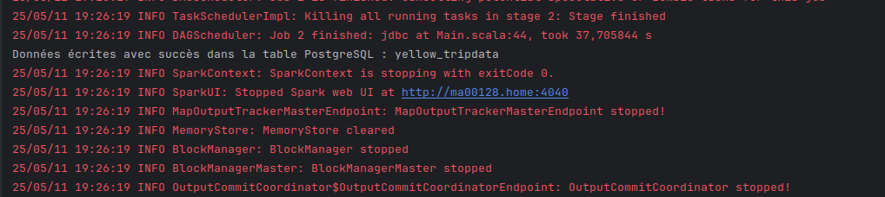
*Fig. 3: Aperçu des données dans la table `yellow_tripdata` de PostgreSQL après le chargement depuis MinIO.*

---

## 5. Modélisation & Data Mart (TP3)

Cette phase du projet se concentre sur la création et le peuplement d'un Data Mart modélisé en schéma en flocon (ou étoile, la distinction fine dépendant de la normalisation des dimensions, ici `dim_location` pourrait être dénormalisée ou pointer vers d'autres dimensions de lieux plus granulaires). Le Data Mart est implémenté dans PostgreSQL et est alimenté à partir du Data Warehouse (contenant la table `yellow_tripdata`). Les scripts SQL pour cette étape se trouvent dans le répertoire `sql_scripting/`.

**Structure du Data Mart (`sql_scripting/creation.sql`)** :

1. **Tables de Dimension** : Plusieurs tables de dimension sont créées pour stocker les attributs descriptifs des données de trajets :

   * `dim_vendor`: Informations sur les fournisseurs de taxi.
   * `dim_rate_code`: Détails sur les codes tarifaires appliqués.
   * `dim_payment_type`: Types de paiement utilisés.
   * `dim_location`: Informations sur les lieux de prise en charge et de dépose. Cette dimension est initialement peuplée avec les ID de localisation et est conçue pour être enrichie avec des détails comme l'arrondissement (borough) et la zone, potentiellement à partir de tables de référence externes.
   * `dim_date`: Une dimension calendaire détaillée (année, mois, jour, jour de la semaine, nom du jour/mois, trimestre, indicateur de week-end) générée à partir des dates de trajets.
     Chaque table de dimension possède une clé primaire auto-incrémentée (surrogate key, ex: `vendor_key`) et conserve la clé métier de la source (ex: `vendor_id`) pour référence.
2. **Table de Faits (`fact_trips`)** :

   * Cette table centrale stocke les mesures quantitatives des trajets de taxi.
   * Elle contient des clés étrangères pointant vers les clés primaires des tables de dimension (ex: `vendor_key`, `pickup_date_key`, `pickup_location_key`).
   * Elle inclut des mesures telles que `passenger_count`, `trip_distance`, `fare_amount`, `tip_amount`, `total_amount`, `trip_duration` (calculée).
   * Une dimension dégénérée, `store_and_fwd_flag`, est également présente.
3. **Indexation** : Des index sont créés sur les clés étrangères de la table de faits pour optimiser les performances des requêtes analytiques (jointures).
4. **Extension `dblink`** : Le script de création s'assure que l'extension PostgreSQL `dblink` est disponible, car elle est utilisée pour l'insertion des données depuis le Data Warehouse.

**Processus de Peuplement (`sql_scripting/insertion.sql`)** :

1. **Connexion au Data Warehouse** : Le script utilise `dblink` pour établir une connexion à la base de données du Data Warehouse (identifiée comme `taxi` sur l'hôte `data-warehouse`) et interroger la table `yellow_tripdata`.
2. **Peuplement des Tables de Dimension** :
   * Les données distinctes pour les vendeurs, les codes tarifaires, les types de paiement et les ID de localisation sont extraites de la table `yellow_tripdata` et insérées dans leurs dimensions respectives. La clause `ON CONFLICT DO NOTHING` est utilisée pour gérer la réexécution idempotente du script.
   * La dimension `dim_date` est peuplée en extrayant toutes les dates uniques de prise en charge et de dépose des trajets, puis en calculant les attributs calendaires pour chacune.
3. **Enrichissement de `dim_location`** :
   * Une table temporaire `staging_locations` est créée et peuplée avec des données de référence pour les localisations (ID, arrondissement, zone, zone de service).
   * Un script `UPDATE` (non montré dans l'extrait `insertion.sql` initial mais typiquement la prochaine étape) utiliserait ces données de staging pour enrichir les colonnes `borough`, `zone`, et `service_zone` dans `dim_location` en joignant sur `location_id`.
4. **Peuplement de la Table de Faits (`fact_trips`)** :
   * Les enregistrements de la table `yellow_tripdata` sont lus via `dblink`.
   * Pour chaque enregistrement source, des jointures sont effectuées avec les tables de dimension (sur leurs clés métier) pour obtenir les clés de substitution correspondantes.
   * Ces clés de substitution, ainsi que les mesures et la dimension dégénérée, sont insérées dans `fact_trips`.
   * La durée du trajet (`trip_duration`) est calculée comme la différence entre `tpep_dropoff_datetime` et `tpep_pickup_datetime`.

Cette modélisation permet des analyses efficaces sur les données de trajets, en facilitant les agrégations et les explorations selon différentes dimensions.

---

## 6. API REST et Application de Visualisation Interactive (DataViz - TP4)

Pour valoriser les données transformées et stockées dans le Data Mart, une application web full-stack nommée "DataViz" a été développée. Elle permet l'analyse, la visualisation interactives des données de trajets et l'exposition des données via une API RESTful performante. Le code source de cette application est disponible sur le dépôt GitHub [nicoooo972/dashboard-big-data](https://github.com/nicoooo972/dashboard-big-data) [1].

**Architecture de l'application DataViz :**

* **Backend (API RESTful)** :

  * **Rôle** : Servir de couche d'accès principale aux données agrégées du Data Mart, fournir des endpoints REST structurés, et implémenter une logique métier pour des agrégations à la volée.
  * **Langage** : Rust, choisi pour sa performance, sa gestion de la mémoire sécurisée, sa forte typisation et son écosystème pour le développement web.
  * **Framework Web** : Axum, un framework modulaire et ergonomique basé sur Tokio.
  * **ORM** : Diesel, pour interagir avec la base de données PostgreSQL (Data Mart).
  * **Asynchrone** : Tokio, pour gérer efficacement les connexions concurrentes.
  * **Fonctionnalités Exposées** : L'API fournit divers endpoints pour des analyses telles que :
    * Volume et caractéristiques des trajets (nombre total, montants moyens, distances moyennes, durées moyennes).
    * Analyse par type de paiement (nombre de trajets, pourboire moyen par type).
    * Activité par période temporelle (horaire, journalière).
    * Répartition par nombre de passagers.
    * Décomposition financière (par exemple, montants moyens par période).
    * Performances par vendeur et par code tarifaire.
    * Statistiques détaillées sur la durée des trajets (moyenne, min, max, percentiles).
    * Indicateurs d'efficacité tarifaire (coût au kilomètre, coût à la minute).
    * Suivi des tendances des principaux indicateurs de performance (KPI).
    * Analyse de l'activité par zone géographique (nombre de trajets, montants moyens par zone).
    * Visualisation des flux de trajets entre différents arrondissements.
* **Frontend (Interface Utilisateur)** :
  Pour interagir avec les données exposées par l'API Rust, une interface utilisateur web a été développée. Elle permet aux utilisateurs d'explorer les données de manière visuelle et intuitive.

  * **Rôle** : Offrir une interface web interactive pour présenter les données analysées sous forme de visualisations dynamiques.
  * **Langage** : Rust avec le framework Yew. Cela permet de bénéficier d'un écosystème cohérent et potentiellement de partager du code ou des types entre le backend et le frontend.
  * **Compilation** : En WebAssembly (WASM) à l'aide de `wasm-pack`. Le WASM s'exécute directement dans le navigateur, offrant des performances proches du natif.
  * **Librairie de Graphiques** : Chart.js est utilisée pour les visualisations de données (graphiques à barres, courbes, etc.), probablement via des bindings ou une interopérabilité directe depuis le code Yew/WASM.
  * **Fonctionnalités Clés** :
    * Tableau de bord interactif présentant les données sous forme de multiples visualisations (graphiques variés, cartes d'information synthétiques).
    * Affichage dynamique des statistiques (par exemple, sur la durée des trajets et l'efficacité tarifaire).
      Cette interface web, propulsée par Rust et WebAssembly, offre une expérience utilisateur réactive pour l'exploration des données de trajets.

Cette application Rust full-stack (API et interface utilisateur) constitue un composant critique, permettant de valoriser les données préparées en les rendant accessibles pour l'exploration, l'analyse et la prise de décision.

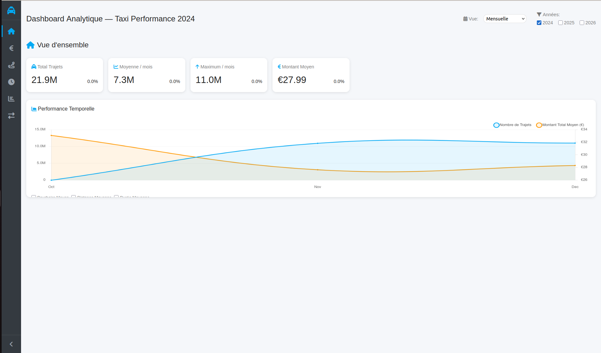
*Fig. 4: Page d'accueil principale du tableau de bord DataViz.*
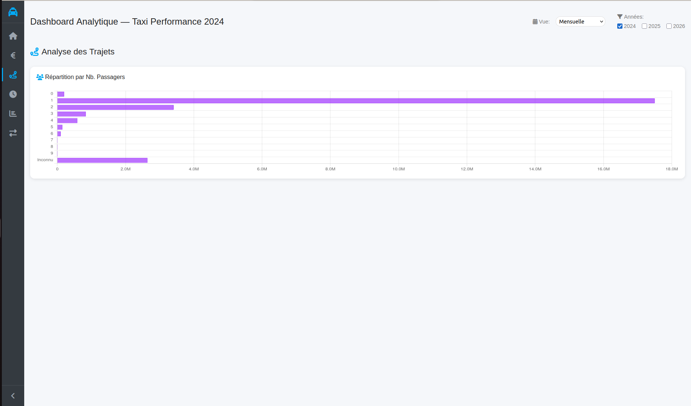
*Fig. 5: Section d'analyse des trajets du tableau de bord DataViz.*
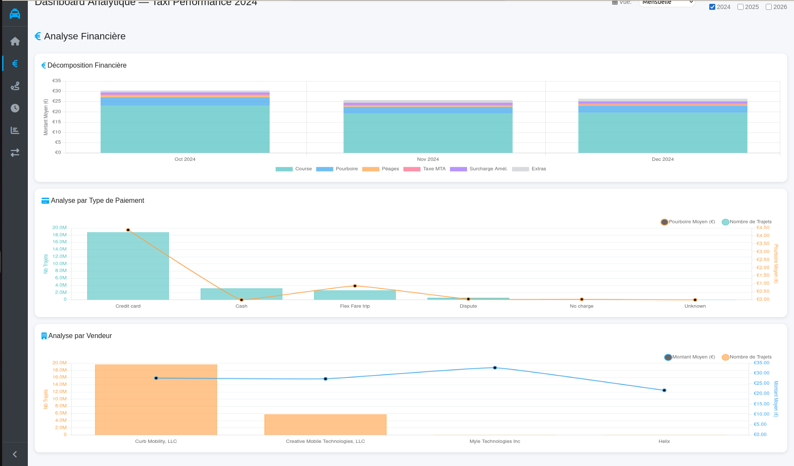
*Fig. 6: Section d'analyse financière du tableau de bord DataViz.*
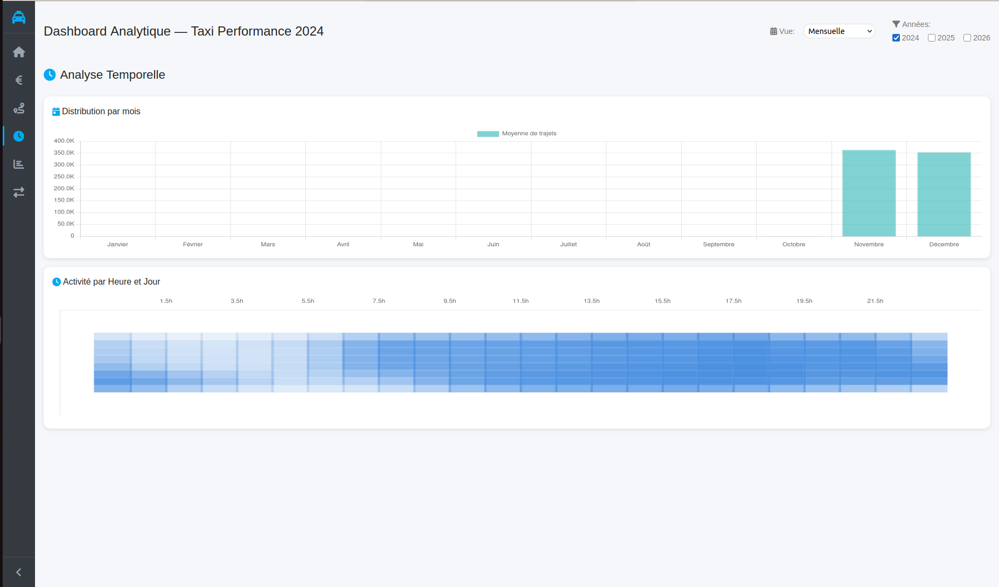
*Fig. 7: Section d'analyse temporelle du tableau de bord DataViz.*
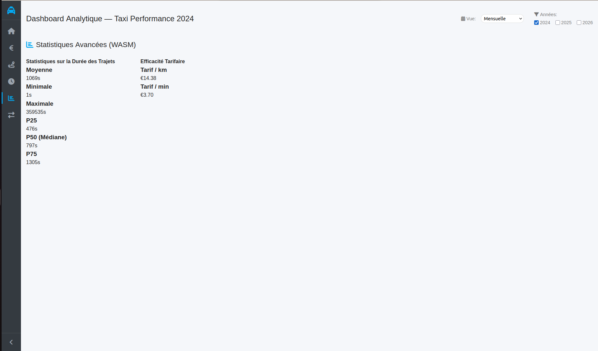
*Fig. 8: Section des statistiques avancées du tableau de bord DataViz.*
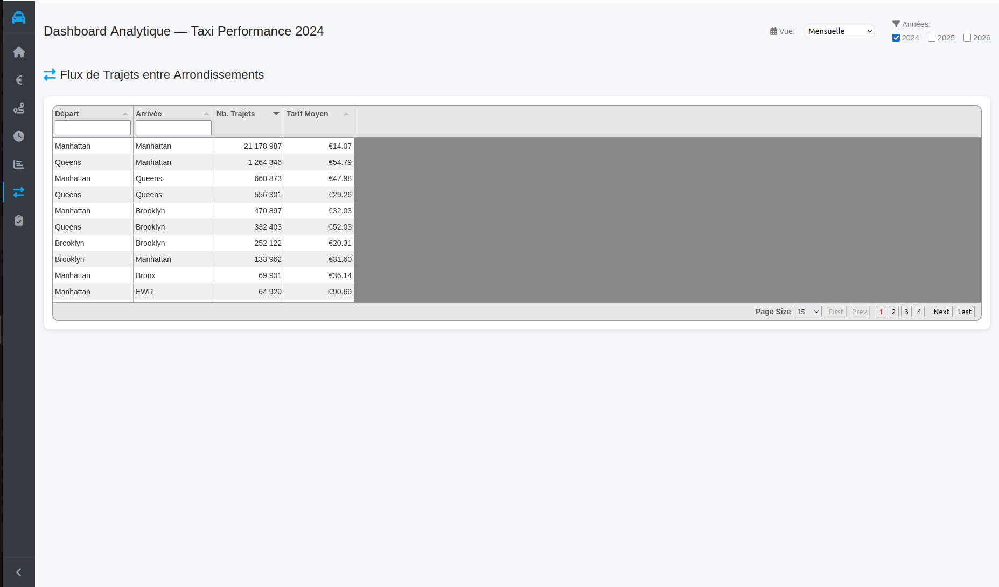
*Fig. 9: Visualisation des flux de trajets entre différentes zones géographiques dans DataViz.*

---

## 7. Orchestration Airflow (TP5)

L'orchestration de l'ensemble du pipeline ETL (Extract, Transform, Load), depuis la collecte des données brutes jusqu'au peuplement du Data Mart, est gérée par Apache Airflow. La configuration se trouve dans le répertoire `airflow/` du projet.

**Architecture d'Orchestration :**
Un DAG maître (`master_dag.py` définissant `master_etl_pipeline`) est responsable du déclenchement séquentiel des différents DAGs qui composent le pipeline global. Chaque DAG subordonné est déclenché et doit se terminer avant que le suivant ne commence.

1. **DAG Maître (`master_etl_pipeline` dans `master_dag.py`)**

   * Utilise `TriggerDagRunOperator` pour lancer et attendre la complétion des DAGs suivants dans l'ordre.
2. **DAG de Collecte (`Grab_NYC_Data_to_Minio` dans `dags.py`)
   (Déclenché comme `download_yellow_taxi_data` par le DAG maître)**

   * **Objectif** : Collecter les données brutes et les stocker dans le Data Lake (Minio).
   * **Tâches** (exécutées via `PythonOperator`) :
     * `download_parquet`: Télécharge les fichiers Parquet des données de taxi jaune (pour une période définie, ex: 3 mois) depuis une source externe (URL cloudfront) vers un répertoire local temporaire.
     * `upload_file_task`: Téléverse ces fichiers Parquet locaux vers le bucket `spark` sur Minio. Les fichiers locaux sont supprimés après le téléversement.
3. **DAG de Chargement vers le Data Warehouse (`Minio_to_Postgres` dans `dags2.py`)
   (Déclenché comme `load_data_to_datawarehouse` par le DAG maître)**

   * **Objectif** : Transférer les données du Data Lake (Minio) vers le Data Warehouse (PostgreSQL).
   * **Tâches** (exécutées via `PythonOperator`) :
     * `download_from_minio`: Télécharge les fichiers Parquet depuis le bucket `spark` de Minio vers un répertoire local temporaire. Les chemins des fichiers sont partagés via XCom.
     * `insert_into_postgres`: Lit chaque fichier Parquet téléchargé (avec Polars), effectue des transformations mineures (normalisation des noms de colonnes, suppression de colonnes spécifiques), puis insère les données dans la table `yellow_tripdata` de la base de données `taxi` du Data Warehouse (en mode `append`). Les fichiers locaux sont supprimés.
4. **DAG de Migration vers le Data Mart (`DWH_to_DM_Migration` dans `dags3.py`)
   (Déclenché comme `migrate_datawarehouse_to_datamart` par le DAG maître)**

   * **Objectif** : Transformer les données du Data Warehouse et peupler le Data Mart (schéma en étoile/flocon dans PostgreSQL).
   * **Tâches** (exécutées via `PythonOperator`, utilisant Polars et SQLAlchemy) :
     * Migrations parallèles des tables de dimension (`dim_vendor`, `dim_rate_code`, `dim_payment_type`, `dim_location`, `dim_date`): Lecture des données distinctes depuis le DWH, enrichissement (ex: noms à partir d'ID, détails de localisation, génération d'attributs de date), filtrage des enregistrements déjà existants dans le DM, et insertion des nouveaux enregistrements dans les tables de dimension respectives du DM (`taxi_olap`).
     * Migration de la table de faits (`migrate_fact_trips`): Exécutée après la complétion des migrations des dimensions. Lit les données de `yellow_tripdata` du DWH, effectue des jointures avec les dimensions dans le DM pour obtenir les clés de substitution, et insère les données transformées dans la table `fact_trips` du DM. Gère potentiellement les nouvelles données et l'insertion par lots.
     * Troncature de la table source (`truncate_source_table`): Après une migration réussie vers le Data Mart, cette tâche vide la table `yellow_tripdata` dans le Data Warehouse source.

**Points Notables :**

* Les DAGs utilisent des `PythonOperator` pour exécuter la logique ETL, souvent avec des bibliothèques comme Polars pour la manipulation de données et SQLAlchemy ou des connecteurs Minio/Postgres directs.
* Une attention est portée à l'idempotence (ex: ne pas réinsérer des données de dimension déjà existantes) et à la gestion des ressources (ex: suppression des fichiers locaux temporaires, traitement par lots pour la table de faits).
* Il existe des petites variations de nommage des DAGs entre le `master_dag.py` et les fichiers DAGs individuels, ce qui pourrait être harmonisé pour plus de clarté.
* Cette orchestration Airflow assure l'exécution automatisée, ordonnancée et répétable de l'ensemble du pipeline de traitement de données.

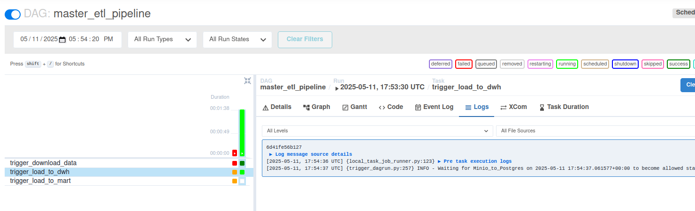
*Fig. 10: Vue graphique du DAG maître `master_etl_pipeline` dans Airflow, orchestrant les étapes du pipeline.*

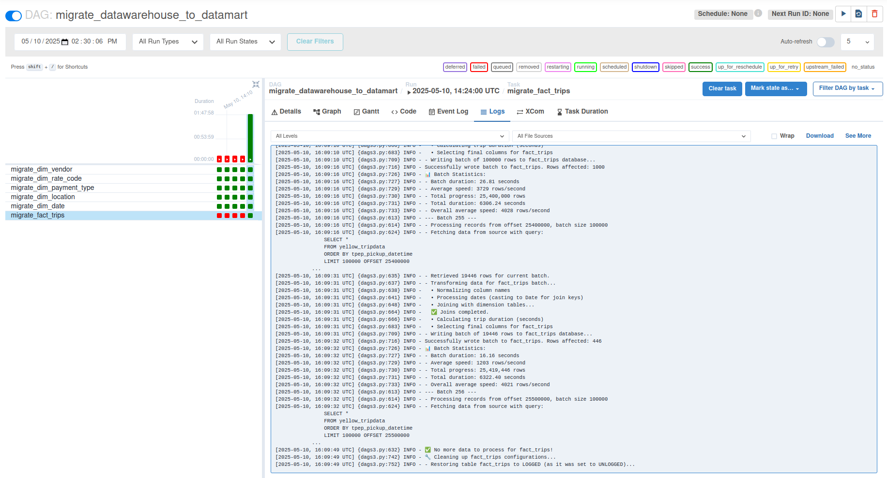

*Fig. 11: Vue graphique du DAG `DWH_to_DM_Migration` (migrate_datawarehouse_to_datamart) dans Airflow.*

* Le DAG ci-dessus va lancer la migration des données vers le datamart. Pour alléger la migration, on l'effectue par des jeux de 100 000 données par 100 000 et cette methode nous permet de bien suivre l'avancement de la migration.

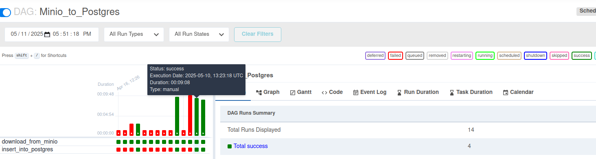
*Fig. 12: Vue graphique du DAG `Minio_to_Postgres` (load_data_to_datawarehouse) dans Airflow.*
* Ajout des fichiers parquets qui sont stockés dans le minio dans la base de données (Postgres).

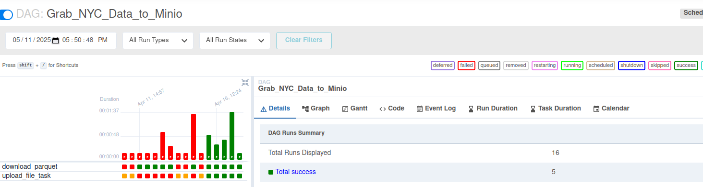
*Fig. 13: Vue graphique du DAG `Grab_NYC_Data_to_Minio` (download_yellow_taxi_data) dans Airflow.*
* Téléchargements des fichiers parquets depuis le site internet.

---

## 8. Surveillance de la Qualité des Données

Au-delà de l'accès et de la visualisation des données métier, assurer et surveiller la qualité des données est fondamental pour garantir la fiabilité des analyses et des décisions. Dans le cadre de ce projet, notamment pour valoriser les données via l'application Rust ([nicoooo972/dashboard-big-data](https://github.com/nicoooo972/dashboard-big-data)) [1], une démarche de suivi de la qualité des données peut être mise en œuvre. L'objectif est d'intégrer des indicateurs de qualité dans un tableau de bord dédié ou au sein des visualisations existantes. L'approche envisagée s'articule autour des étapes suivantes :

1. **Définition des Dimensions de Qualité Clés** : Identifier les aspects de la qualité des données les plus critiques pour le contexte des données de trajets. Cela inclut typiquement :

   * **Complétude** : Taux de remplissage des champs essentiels (ex: heures de début/fin, lieux, montants).
   * **Validité** : Conformité des données à des formats attendus (ex: format des dates, types numériques) ou à des règles métier (ex: `trip_distance` positive).
   * **Unicité** : Détection d'enregistrements de trajets dupliqués.
   * **Cohérence** : Consistance des informations à travers différentes colonnes ou par rapport à des logiques attendues (ex: `tpep_dropoff_datetime` postérieur à `tpep_pickup_datetime`).
   * **Actualité** : Fraîcheur des données, particulièrement si les ingestions sont fréquentes.
   * **Précision** : Exactitude des valeurs (plus difficile à mesurer sans source de vérité externe, mais des vérifications de plausibilité peuvent être faites).
2. **Profilage des Données et Calcul des Métriques** : Mettre en place des mécanismes (scripts, requêtes SQL sur le Data Mart, ou fonctionnalités au sein de l'application Rust) pour profiler les données et calculer des métriques quantitatives pour chaque dimension de qualité identifiée. Exemples :

   * Pourcentage de champs obligatoires renseignés.
   * Pourcentage de valeurs valides pour des champs spécifiques.
   * Nombre ou pourcentage d'enregistrements en doublon.
   * Nombre d'incohérences détectées.
3. **Intégration et Exposition des Métriques** : Les métriques de qualité calculées peuvent être stockées (par exemple, dans des tables dédiées du Data Mart) et exposées via l'API Rust. De nouveaux endpoints pourraient fournir ces indicateurs.
4. **Visualisation sur un Tableau de Bord** : Utiliser le frontend Yew/WASM pour afficher ces métriques de qualité. Les visualisations pourraient inclure :

   * Graphiques en barres pour les pourcentages de complétude/validité.
   * Indicateurs de performance clés (KPIs) avec des seuils (ex: scores de qualité globale).
   * Tableaux listant les problèmes de qualité détectés pour analyse.
   * Graphiques de tendance montrant l'évolution de la qualité des données dans le temps.
5. **Alertes Automatisées** : Envisager la mise en place d'alertes (par exemple, si une métrique de qualité chute sous un seuil critique) pour notifier les responsables et permettre une action corrective rapide. Ces alertes pourraient être gérées côté backend (Rust) ou via des outils externes si le pipeline est étendu.
6. **Documentation et Feedback** : Associer au tableau de bord de qualité une documentation expliquant les métriques, et potentiellement un système pour tracer les problèmes de qualité identifiés et les actions entreprises. Ce processus soutient la gouvernance des données.

Cette approche proactive de la surveillance de la qualité des données renforce la confiance dans les informations fournies par le système et permet une amélioration continue du pipeline de données.

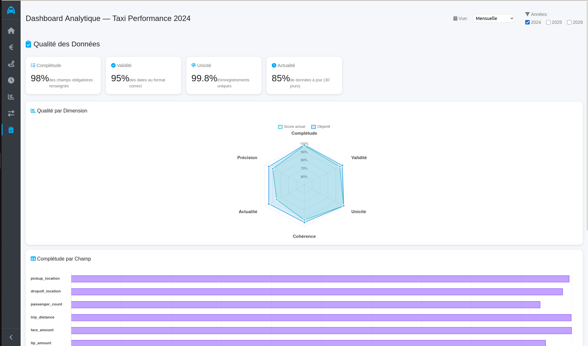
*Fig. 14: Tableau de bord pour la surveillance de la qualité des données, affichant divers indicateurs.*
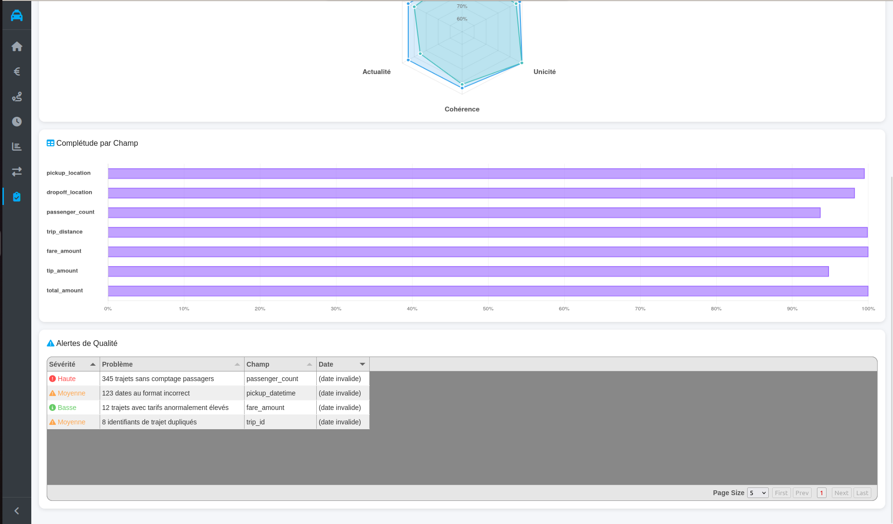
*Fig. 15: Suite du tableau de bord de surveillance de la qualité, détaillant d'autres métriques.*
---

## 9. Gestion des Logs et Surveillance

Une journalisation (logging) extensive a été mise en œuvre à travers les différents composants de ce projet. Dans un écosystème Big Data impliquant de multiples services interagissant (Airflow, Spark, MinIO, PostgreSQL), une stratégie de logging robuste est fondamentale pour plusieurs raisons :

1. **Débogage et Diagnostic Facilités** :

   * Les pipelines Big Data sont souvent complexes et distribués. Des logs détaillés à chaque étape (ingestion, transformation, chargement) et dans chaque service permettent de tracer le flux de données et d'identifier rapidement l'origine des erreurs ou des comportements inattendus.
   * Dans Spark, par exemple, les logs des pilotes et des exécuteurs sont essentiels pour comprendre les échecs de tâches, les problèmes de performance (comme le déversement sur disque) ou les erreurs de configuration.
   * Pour Airflow, les logs des tâches individuelles sont indispensables pour diagnostiquer pourquoi un DAG ou une tâche spécifique a échoué.
2. **Surveillance (Monitoring) du Pipeline** :

   * Les logs fournissent des informations précieuses pour surveiller l'état de santé général du système et la progression des traitements.
   * Ils permettent de suivre le volume de données traité, les temps d'exécution des différentes étapes, et l'utilisation des ressources.
   * Des outils de centralisation de logs (non implémentés ici mais une étape suivante logique, ex: ELK Stack, Grafana Loki) peuvent s'appuyer sur ces logs pour créer des tableaux de bord de surveillance en temps réel et des alertes.
3. **Audit, Traçabilité et Gouvernance des Données** :

   * Les logs constituent un enregistrement immuable des opérations effectuées sur les données. Cela est crucial pour l'audit et la conformité réglementaire.
   * Ils aident à comprendre la lignée des données (data lineage) : d'où viennent les données, quelles transformations ont-elles subies, et où ont-elles été chargées.
   * En cas de problème de qualité des données, les logs peuvent aider à remonter à la source de l'erreur.
4. **Optimisation des Performances** :

   * L'analyse des logs (par exemple, les temps d'exécution des tâches Spark, les requêtes lentes dans PostgreSQL) peut révéler des goulots d'étranglement et des opportunités d'optimisation dans le pipeline de données.
5. **Reprise sur Erreur et Fiabilité** :

   * En cas de défaillance d'un composant, des logs précis sur l'état avant l'incident peuvent être cruciaux pour comprendre la cause et pour mettre en œuvre des stratégies de reprise efficaces (par exemple, savoir quelles données ont été traitées avant un arrêt inopiné).

Dans ce projet, vous trouverez des logs générés par :

* **Docker Compose** : Pour les logs de chaque service conteneurisé. Utilisez `docker-compose logs <nom_du_service>`.
* **Airflow** : Les logs de chaque tâche sont accessibles via l'interface web d'Airflow et stockés dans le volume `airflow/logs`.
* **Spark** : Les applications Spark génèrent des logs pour le driver et les exécuteurs, souvent consultables via l'interface web de Spark Master et/ou les sorties standard des conteneurs worker.
* **PostgreSQL** et **MinIO** : Ces services ont également leurs propres mécanismes de logging, configurables et accessibles via les logs Docker.

Bien que la centralisation et l'analyse avancée des logs ne fassent pas partie du scope initial, il est important de souligner que la quantité et la qualité des logs produits ici sont une fondation pour de telles améliorations futures.

## 10. Conclusion & perspectives

Ce projet a démontré la mise en place d'un pipeline Big Data complet, du cluster Spark à la dashboard web, en passant par une API Rust performante.

## 11. Annexes

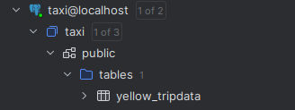
*Fig. 18: Structure de la table `yellow_tripdata` dans le Data Warehouse.*

*Fig. 17: Aperçu des données dans la table `yellow_tripdata` du Data Warehouse.*

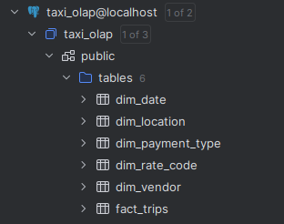
*Fig. 16: Structure du Data Mart (schéma en flocon).*

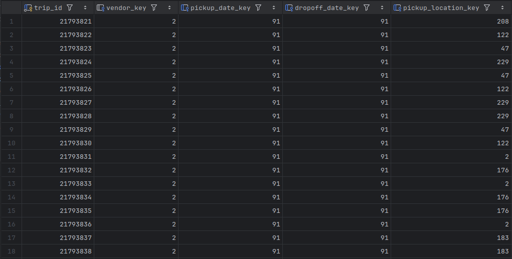
*Fig. 19: Aperçu des données dans les tables du Data Mart.*

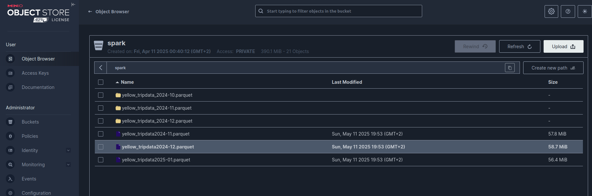
*Fig. 20: Aperçu des fichier parquets dans minio.*
